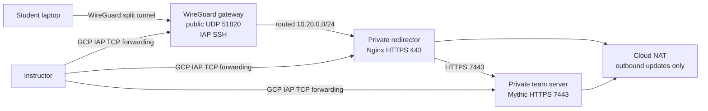

# Architecture

## Security boundaries

The WireGuard gateway is the only VM with an external address. Its public firewall permits only
UDP/51820. SSH to every VM is restricted to Google's IAP TCP-forwarding range.

Students receive split-tunnel routes only for `10.20.0.0/24`. GCP firewall policy permits the
WireGuard client range to reach the redirector on TCP/443 and ICMP. It does not permit student
connections to SSH, the team server, or other VPN peers.

## Student-visible network

| Source | Destination | Permitted traffic | Purpose |
| --- | --- | --- | --- |
| Student laptop | VPN gateway public IP | UDP/51820 | Establish WireGuard |
| Student VPN address | Redirector private IP | TCP/443 | Open the Mythic web interface |
| Student VPN address | Redirector private IP | ICMP | Basic connectivity diagnostics |
| Redirector | Team server private IP | TCP/7443 | Proxy the Mythic web interface |
| Student VPN address | Team server, SSH, or other VPN peers | None | Explicitly blocked |

The current deployment has no target or victim VM. It provides controlled access to Mythic, but
does not by itself provide a system on which students can execute payloads or practice
exploitation. Any such target must be separately provisioned, isolated, and explicitly added to
the written scope.

The redirector is a teaching boundary, not an evasion system. It terminates a self-signed TLS
session and proxies to Mythic's private HTTPS UI. A real authorized engagement would use a
listener-specific redirector configuration whose paths and headers match the selected C2 profile.

The private subnet uses Cloud NAT because first boot must download Debian packages, Docker, and
the pinned Mythic release. NAT supplies outbound connectivity but does not create inbound access.

## Why this is minimal

The VPN gateway also serves as the network jump point, eliminating a separate bastion. There is
one framework and one redirector. DNS, public callback infrastructure, CDNs, multiple providers,
Havoc, payload hosting, and automated rotation are deliberately excluded because they add cost
and do not help the internal classroom objective.

## Trust and data

Terraform state contains the WireGuard server private key because the gateway is configured from
IaC. Keep state local on an encrypted instructor workstation, or migrate it to a tightly
permissioned encrypted GCS backend before involving additional administrators.

Student private keys never enter Terraform, GCP metadata, forms, sheets, or instructor storage.
Only student public keys are entered into Terraform. Mythic contains class activity and should be
treated as sensitive course data.
